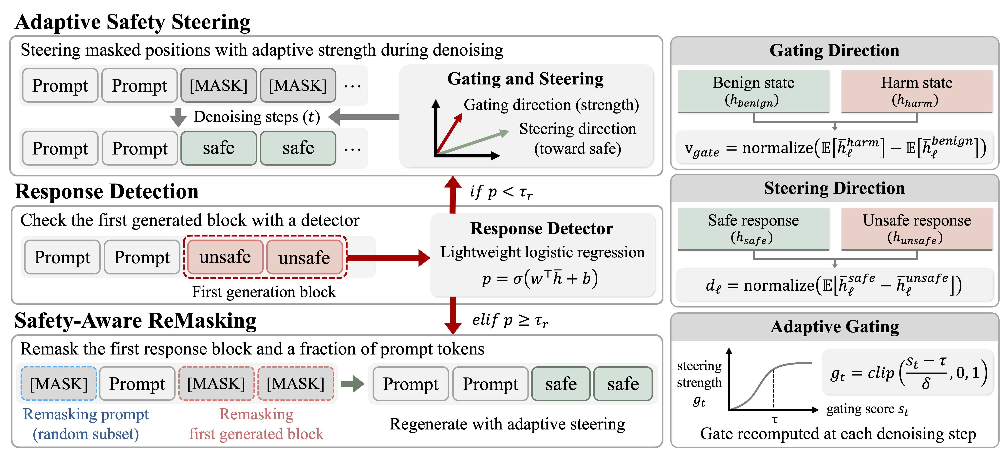
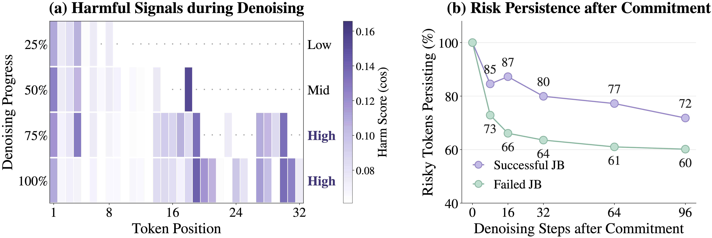
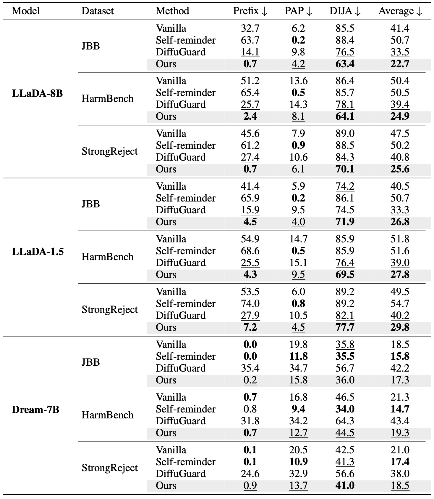


# Adaptive Steering and Remasking for Safe Generation in Diffusion Language Models

> **Adaptive Steering and Remasking** is an inference-time defense for diffusion language models (DLMs). It adapts the strength of safety steering to the current denoising state and, when a lightweight detector flags the first generated block as unsafe, remasks that block together with part of the prompt and regenerates it under steering.

## 🛡️ Overview



DLMs generate text by iteratively denoising a fully masked sequence, so harmful content can emerge at arbitrary positions and persist across later denoising steps. Existing defenses rely on fixed interventions or aggressive remasking, which limits control over the denoising trajectory and can degrade generation quality.

Our framework combines three lightweight components that operate directly on intermediate hidden representations:

- **Adaptive safety steering.** A *gating direction* scores the current denoising state at every step and converts the score into a continuous steering strength. A *steering direction* is then added to the hidden states of the currently masked positions, guiding the next predictions toward a safe trajectory.
- **Response detection.** After the first generation block is committed, a logistic-regression *response detector* (4k parameters) reads the mean hidden state of the block and estimates the probability that the trajectory is unsafe.
- **Safety-aware remasking.** When the detector triggers, the first response block and a random fraction of the prompt tokens are returned to `[MASK]`, and the region is regenerated under adaptive safety steering.

Steering prevents unsafe semantic trajectories, while remasking corrects harmful content that has already entered the generation state. Outside detected unsafe trajectories the original denoising procedure is preserved, which limits unnecessary intervention on benign prompts.

## Preliminary Analysis

### Localized and Persistent Harmful Signals

<p align="center">
  
</p>

We track token-level harmfulness, the cosine similarity between hidden states and the harmful direction, on LLaDA with JBB-Behaviors prompts during the first generation block.

- **(a) Harmful signals are step-dependent.** The signal is weak at the early denoising stage, becomes stronger in the middle stage, and reaches high intensity in the later stages. A fixed steering strength therefore under-intervenes at high-risk steps or over-intervenes at low-risk steps.
- **(b) Risk persists after commitment.** Successful jailbreak trajectories retain 80% of their risky tokens after 32 steps and 72% after 96 steps; failed trajectories still retain 64% and 60%. Vanilla denoising does not reliably eliminate risky representations once a token is committed.

> Steering strength should follow the denoising-stage risk, and committed risky tokens have to be reopened explicitly.


### Motivation

Instead of a fixed intervention, we control the trajectory with:

- **adaptive steering** whose strength is recomputed from the generation state at every denoising step
- **targeted remasking** of the first generated block and part of the prompt, triggered only when the trajectory is detected as unsafe

## Method

### 1. Safety Representation Directions

Two directions are built from different contrastive pairs because they serve different roles at inference.

- **Gating direction** $v_{gate}$: paired harmful and benign inputs with a fully masked generation region. The direction is the normalized difference of the mean hidden states over the masked positions at the gating layer $\ell_g$. It captures the representation shift of a harmful generation context and controls the steering strength.
- **Steering direction** $v_{steer}$: the input is fixed and a safe refusal response is contrasted with an unsafe compliance response under the same random mask pattern. Hidden states are taken from the masked positions only at the steering layer $\ell_s$, and the per-ratio directions are averaged over the masking ratios {0.3, 0.5, 0.7, 0.8}. This keeps the shifts that consistently separate safe refusal from unsafe compliance across masking levels.

### 2. Adaptive Safety Steering

At each denoising step $t$, the mean hidden state of the committed positions (the masked positions at the very first step) is projected onto the gating direction and turned into a gate

$$s_t = \bar h^{(t)\top}_{\ell_g} v_{gate}, \qquad g_t = \mathrm{clip}\left(\frac{s_t - \tau}{\delta}, 0, 1\right),$$

where $\tau$ is the gating threshold and $\delta$ the transition width. Steering is applied only to the currently masked positions $\mathcal{M}_t$:

$$h^{(t)}_{\ell_s, j} \leftarrow h^{(t)}_{\ell_s, j} + g_t\,\alpha\,r_{\ell_s}\,v_{steer}, \qquad j \in \mathcal{M}_t .$$

**Key Idea**
> high gating score → stronger steering
> low gating score → no intervention

The gating layer precedes the steering layer, so the gate and the intervention are computed within the same forward pass. Committed positions are never modified, and the intervention weakens naturally as the trajectory moves away from the gated direction.

### 3. Safety-Aware Remasking

Detection runs once, right after the first generation block, where the trajectory is still cheap to redirect.

1. Average the hidden states of the committed positions of the first block at the detector layer $\ell_r$.
2. A logistic-regression detector estimates the unsafe probability $p = \sigma(w^\top \bar h_{\ell_r} + b)$.
3. If $p \ge \tau_r$, remask the first block together with a fraction $\gamma_p$ of the prompt tokens (80% in our experiments).
4. Regenerate the remasked region through the original denoising process under adaptive safety steering.

Remasking the prompt disrupts the adversarial context that would otherwise keep anchoring the denoising trajectory, while benign intent survives partial prompt corruption.

## Experimental Results

Settings: maximum sequence length 128, block size 32, 128 denoising steps, temperature 0.2, prompt remasking ratio 80%. Attacks are Prefix (HarmBench prefix template), PAP (Qwen3-14B paraphrasing, Expert Endorsement) and DIJA. ASR is averaged over `Llama-Guard-4-12B` and `gpt-oss-20b` (StrongREJECT rubric) and over three runs.

### Jailbreak Defense

<p align="center">
  
</p>

- On LLaDA-8B the average ASR drops from 41.4 to 22.7 (JBB), 50.4 to 24.9 (HarmBench) and 47.5 to 25.6 (StrongReject), and ASR against Prefix attacks falls below 3% on every dataset.
- Our method improves on the vanilla model in all nine model-dataset combinations and achieves the best or second-best average ASR in every setting. Self-reminder is strong on Dream-7B but does not transfer to LLaDA, where it raises the JBB average from 41.4 to 50.7.
- DiffuGuard produces more than 80% broken sentences on Dream-7B, whereas our method keeps the broken-sentence ratio at the vanilla level.

### Over-Refusal and Capability Preservation



Over-refusal is judged by gpt-oss on XSTest and TruthfulQA; capability is accuracy on MATH-500 and GSM8K and exact match on TruthfulQA.

- MATH-500 and TruthfulQA remain nearly unchanged on all three models; most of the degradation is concentrated on GSM8K for LLaDA-8B (82 → 73).
- LLaDA-8B and LLaDA-1.5 show only small increases in refusal on benign prompts, while Dream-7B *reduces* over-refusal on XSTest from 33% to 24% even though it has the highest baseline over-refusal.


## 🛠️ Repository

Gated activation steering with response-detector remasking (the `ours` defense) for
masked-diffusion language models, evaluated against jailbreak attacks (PAP, DIJA)
next to the DiffuGuard and Self-Reminder baselines. Target models are
`GSAI-ML/LLaDA-8B-Instruct` (default) and `Dream-org/Dream-v0-Instruct-7B` (`--model dream`).
The deployed hyperparameters of each model are listed in sections 5 and 6.

## 1. Environment and data

Run every command from the repository root.

```bash
uv venv --python 3.12 .venv
uv pip install -p .venv/bin/python -r requirements.txt
# or: python3.12 -m venv .venv && .venv/bin/pip install -r requirements.txt
.venv/bin/python data_downloader.py
```

`requirements.txt` is fully pinned (torch 2.3.1 with CUDA 12.1 wheels, transformers 4.55.4).
Model weights are fetched from the Hugging Face Hub on first use; point `HF_HOME` at an
existing cache if you keep one. Downloading AdvBench and HarmBench requires accepting the
dataset terms on the Hub and authenticating (`huggingface-cli login` or `HF_TOKEN`).

| Benchmark | `--source` | Rows |
|---|---|---:|
| JBB | `jbb_harmful` | 100 |
| HarmBench | `harmbench` | 393 |
| StrongREJECT | `strongreject` | 313 |

`--n` defaults to **20**; pass the row counts above for a full evaluation. PAP and PAIR use
the original datasets; only DIJA uses its own refined prompts.

Graders: attack success is judged by `meta-llama/Llama-Guard-4-12B` (gated on the Hub) and
by the StrongREJECT rubric with `gpt-oss:20b` served by Ollama. The evaluation scripts start
the Ollama container themselves; `ollama_setting/` holds the podman image and model pull
scripts.

`exp.py`, `pap_generate.py` and the graders show one tqdm bar per task; when a run is
sharded over several GPUs, each child process writes its full output to a log next to its
part file.

### Defenses

| `--defense` | Description | Requires |
|---|---|---|
| `none` | no defense | nothing |
| `ours` | gate, steering and V3 remasking | the checkpoints below |
| `diffuguard` | DiffuGuard | the generator code bundled in `diffuguard/` |
| `selfreminder` | a safety reminder prepended to the prompt | nothing |

The default paths of `ours` expect these files; they have to be prepared separately
(`script/build_vectors.sh` fits the vector, the gate detector and its threshold, and
`python -m dlm_steering.fitting.fit_response_detector` the response detector).

```text
outputs/steer_vector.pt
outputs/steer_detector.pt
outputs/gate_threshold.json
outputs/response_detector.pt
```

## 2. PAP: generate the attack, run the defenses, grade

### 2-1. Generate the attack prompts

```bash
CUDA_VISIBLE_DEVICES=0 .venv/bin/python pap_generate.py \
  --source jbb_harmful --seed 42 --reproduct \
  --out data/attacks/pap_better/jbb_harmful/seed42.json

# several GPUs: one worker per GPU, shards validated and merged into --out
.venv/bin/python pap_generate.py --source jbb_harmful --seed 42 --reproduct --gpus 0,1,2,3 \
  --out data/attacks/pap_better/jbb_harmful/seed42.json
```

- The default attacker model is **Qwen/Qwen3-14B** (change with `--model`).
- One attack sentence is generated per row. There are no retries and no internal grading.

### 2-2. Run two defenses on the same attack cache

The default cache path is picked automatically; `--pap-cache <file>` selects another one.

An attack cache is **generated once per dataset and seed** and shared by every model and
defense under comparison. This step does not load the attacker model.

```bash
# V3
CUDA_VISIBLE_DEVICES=0 .venv/bin/python exp.py \
  --attack pap \
  --defense ours --alpha 1 --steer adaptive --remask v3 --remask-prompt \
  --source jbb_harmful --n 100 --seed 42 --reproduct \
  --gen-length 128 --steps 128 --block-length 32 --temperature 0.2 \
  --out outputs/JBB-pap-v3-42.json

# DiffuGuard
CUDA_VISIBLE_DEVICES=0 .venv/bin/python exp.py \
  --attack pap \
  --defense diffuguard \
  --source jbb_harmful --n 100 --seed 42 --reproduct \
  --gen-length 128 --steps 128 --block-length 32 --temperature 0.2 \
  --out outputs/JBB-pap-diffuguard-42.json
```

`--source`, `--seed` and `--reproduct` must match the settings the cache was generated with.
For seeds 43 and 44 generate the cache of that seed first. Other datasets follow the same order.

To attack another target model directly, feed `results[*].attack_prompt` from the cache
JSON as the user message; `prompt` is the original benchmark question and `index` the
original row id. Caches live under `data/`.

## 3. Other attacks and options

### DIJA

DIJA's Qwen-refined prompts for the three datasets ship in `data/dija/`. They come from the
[DIJA repository](https://github.com/ZichenWen1/DIJA); the license is in `data/dija/LICENSE`.

```bash
CUDA_VISIBLE_DEVICES=0 .venv/bin/python exp.py \
  --attack dija --defense diffuguard \
  --source jbb_harmful --n 100 --seed 42 --reproduct \
  --gen-length 128 --steps 128 --block-length 32 --temperature 0.2 \
  --out outputs/JBB-dija-diffuguard-42.json
```

DIJA's `--gen-length` defaults to 128. Pass `--gen-length 0` to fill only the mask slots
inside the prompt.

### PAIR

PAIR refines its attack from the target's responses, so unlike PAP nothing is generated in
advance. The default attacker is Qwen/Qwen3-14B and the internal success check is the GCG
keyword test. The default search budget is **5 streams x 5 iterations**.

```bash
CUDA_VISIBLE_DEVICES=0,1 .venv/bin/python exp.py \
  --attack pair --defense diffuguard \
  --source jbb_harmful --n 100 --seed 42 --reproduct \
  --gen-length 128 --steps 128 --block-length 32 --temperature 0.2 \
  --out outputs/JBB-pair-diffuguard-42.json
```

PAIR uses two GPUs: one for the target, one for the attacker model.

### Common options

- `--attack`: `none`, `prefix`, `dija`, `pap`, `pair`.
- `--seed` and `--reproduct`: random seed and deterministic kernels. Bit-identical results
  across different GPU architectures are not guaranteed.
- `--start`, `--n`: the row range of the source dataset to run.
- `--gpus 0,1,2,3`: shard the prompt set over several GPUs, one process per GPU over a
  contiguous slice, merged into `--out`. Rows are seeded by index, so the merged file is
  identical to a single-GPU run. PAIR takes two GPUs per shard. Use this instead of the
  `CUDA_VISIBLE_DEVICES=...` of the single-GPU examples.
- V3: `--remask-prompt` also remasks the prompt text (special tokens excluded) when the
  response detector triggers; `--remask-prompt-frac r` reopens a random fraction `r` of it.
- DiffuGuard defaults: SAR (`adaptive_step`), `repair-scope all`, threshold 0.2,
  8 refinement steps, remask ratio 0.9.

The attack- and defense-specific options are listed in the help of the selected pair.

```bash
.venv/bin/python exp.py --attack pap --defense ours --help
.venv/bin/python exp.py --attack pair --defense diffuguard --help
.venv/bin/python pap_generate.py --help
```

## 4. Evaluation

```bash
.venv/bin/python eval_llamaguard.py \
  --in outputs/JBB-pap-v3-42.json --out outputs/JBB-pap-v3-42_lg4.json --gpus 0

.venv/bin/python run_sr_eval.py \
  --in outputs/JBB-pap-v3-42.json --out outputs/JBB-pap-v3-42_sr.json --gpu 0 --port 50001

.venv/bin/python script/report.py \
  outputs/JBB-pap-v3-42_lg4.json outputs/JBB-pap-v3-42_sr.json
```

- **LG4**: attack success rate from Llama-Guard-4's unsafe verdicts.
- **GPT-OSS**: StrongREJECT scores from Ollama's `gpt-oss:20b`.

To grade on several GPUs with automatically managed local Ollama servers, pass
`--auto-server --gpus 0,1 --startup-workers 2` to `run_sr_eval.py`. Up to two servers are
initialised by default: CUDA discovery runs sequentially, model loading overlaps, and a
transient start-up failure is retried twice. `--startup-workers 1` serialises the model loads
too. `--workers` is the per-server grading concurrency once the servers are up.

### Over-refusal and utility

| Purpose | `--source` at generation | Evaluation |
|---|---|---|
| Over-refusal | `truthfulqa`, `xstest_safe`, ... | `python -m dlm_steering.fitting.judge_refusal --in <generations.json> --out <judged.json> --auto-server --gpus 0,1` |
| Utility | `mmlu`, `gsm8k`, `math500`, `truthfulqa_mc` | `python eval_utility.py --in <generations.json> --out <scored.json>` |

Fetch `gsm8k`, `math500` and `truthfulqa` into `data/` with
`python data_downloader.py gsm8k math500 truthfulqa`. For `math500` the last `\boxed{}` is
compared with the reference under the MATH repository's normalisation rules.

Generate these runs with `--attack none` and compare against `--defense none` over the same
row range. Use `.venv/bin/python` for the commands above as well.

## 5. Dream-v0-Instruct-7B

The same method (gated steering + V3 remasking) runs unchanged on
`Dream-org/Dream-v0-Instruct-7B`. With `--model dream` the registry in `models.py` supplies
the model constants (mask token `<|mask|>` = 151666, block path `model.model.layers`,
28 layers, `<|im_end|>`) and the default vector/detector paths move to `outputs/dream/`.
`--model` is read from the command line when `models.py` is imported, so it must be given there
(`--gpus` shard children receive it automatically). The environment is the same `.venv` as
for LLaDA.

### Deployed settings and checkpoints (`outputs/dream/`)

| Artifact | Layer | Notes |
|---|---|---|
| `steer_detector.pt` + `gate_threshold.json` | 14 (`best_layer`) | gate; mean OOD AUROC 0.970, threshold 2.706 |
| `steer_vector.pt` | **20** (pass `--layer 20`) | validation AUROC peaks at 17, but in the alpha sweep layer 17 collapses from alpha 1.5 while layer 20 refuses 100% at alpha 1 and stays fluent |
| `response_detector3_committed_L20.pt` | **20**, cutoff 0.387 | V3 response detector, fitted on first-block-boundary states (`dlm_steering/fitting/fit_boundary_detector.py`) |

Because the response detector's layer (20) differs from the gate layer (14), V3's boundary
audit does not ride the next defended forward: it runs a separate unsteered forward that
stops at the detector layer (`_audit_piggyback` in `dlm_steering/defenses/recovery.py`).
When the two layers coincide, as for LLaDA, the audit piggybacks as before. The checkpoint's
`layer` and `pool` keys decide this, and the result JSON records it under
`defense.response_detector_layer`.

```bash
# one run with the deployed settings (over-refusal, XSTest-safe, 250 prompts)
.venv/bin/python exp.py --model dream --attack none --defense ours --remask v3 --steer adaptive --layer 20 \
  --response-detector outputs/dream/response_detector3_committed_L20.pt \
  --remask-prompt --remask-prompt-frac 0.8 --source xstest_safe --n 250 \
  --gen-length 128 --steps 128 --block-length 32 --seed 42 --gpus 0,1 \
  --out outputs/dream/XSTest-safe-none-v3rp80-42.json
```

### Experiment scripts

The drivers of section 6 take `MODEL=dream`; the deployed Dream flags above come from
`ours_args dream` in `script/common.sh`. The runs behind the Dream results were tagged
`v3rp80`, so `TAG=v3rp80` resumes them:

```bash
MODEL=dream TAG=v3rp80 ATTACK=pap SOURCES=jbb_harmful script/run_benchmark.sh
MODEL=dream TAG=v3rp80 TQA_JUDGE=1 script/run_overrefusal.sh
MODEL=dream TAG=v3rp80 script/run_utility.sh
```

To refit the response detector (generate per arm, label with Llama Guard 4, refit on CPU):

```bash
CUDA_VISIBLE_DEVICES=0 .venv/bin/python -m dlm_steering.fitting.fit_boundary_detector --model dream --arms wildjailbreak,alpaca --gen-only
CUDA_VISIBLE_DEVICES=1 .venv/bin/python -m dlm_steering.fitting.fit_boundary_detector --model dream --arms wj_benign --gen-only
.venv/bin/python -m dlm_steering.fitting.fit_boundary_detector --model dream --pool committed --layer 20 --balanced \
  --from-samples outputs/dream/boundary_samples_{wildjailbreak,wj_benign,alpaca}.pt \
  --out outputs/dream/response_detector3_committed_L20.pt
```

The vector, the gate detector and its threshold are built with the same
`MODEL=dream script/build_vectors.sh` path as for LLaDA. On Dream, omitting
`--detector-layer` / `--layer` falls back to each bundle's `best_layer`, so pass `--layer 20`
for the vector explicitly.

## 6. Scripts

`script/` holds the end-to-end drivers. Each one sources `script/common.sh`, which picks the
interpreter (`PY`, default `.venv/bin/python`), the GPUs (`GPUS`, default: every visible card;
`PROCS_PER_GPU` workers per card) and the deployed `ours` flags per model (`ours_args`).
Every driver skips output files that are already complete, so an interrupted run resumes.

| Script | Runs | Main variables |
|---|---|---|
| `build_vectors.sh` | contrast pairs, steering vector, gate detector, gate threshold (`MODEL=dream` for Dream) | `--force` rebuilds |
| `run_benchmark.sh` | one attack under one defense on the harmful sets and seeds, then Llama Guard 4 + StrongREJECT + report (gen 128, 128 steps, block 32, temperature 0.2, `--reproduct`) | `MODEL`, `ATTACK` (pap/dija/pair), `DEFENSE` (ours/diffuguard/none/selfreminder), `SOURCES`, `SEEDS`, `TAG`, `DEFENSE_ARGS`, `GEN`/`STEPS`/`BLOCK`/`TEMPERATURE` |
| `run_overrefusal.sh` | benign sets under the defense, XSTest three-way refusal judge, per-seed summary `OR-summary-<TAG>.{json,md}`; `TQA_JUDGE=1` adds the TruthfulQA truthful/informative judge | `MODEL`, `DEFENSE`, `SOURCES` (xstest_safe truthfulqa), `SEEDS`, `TAG` |
| `run_utility.sh` | graded sets with and without the defense, scored by `eval_utility.py` | `MODEL`, `SOURCES` (math500 truthfulqa_mc, also mmlu gsm8k), `DEFS`, `SEEDS`, `TAG` |
| `run_ablation_dija_jbb.sh` | the four LLaDA ablation conditions on DIJA/JBB plus grading (`CONDS="allbnd bnd1 bnd2 bnd3"` for the boundary analysis) | `SEED` |
| `report.py` | one table over grader payloads (`*_lg4`, `*_sr`, `*_judged`, `*_acc`) | file arguments, or none for everything under `outputs/` |

```bash
# main table, LLaDA: PAP and DIJA under ours and DiffuGuard, three seeds each
for A in pap dija; do for D in ours diffuguard; do ATTACK=$A DEFENSE=$D script/run_benchmark.sh; done; done
# DiffuGuard in its authors' infilling setting (DIJA spans only, 200 steps)
ATTACK=dija DEFENSE=diffuguard TAG=diffuguard-infill GEN=0 STEPS=200 BLOCK=200 script/run_benchmark.sh
# over-refusal and utility for the deployed LLaDA defense
script/run_overrefusal.sh
script/run_utility.sh
```

The deployed LLaDA flags are steering layer 25, gate detector layer 18 with threshold 7.0,
the response detector `outputs/response_detector.pt` with cutoff 0.12, alpha 1, adaptive
steering and V3 remasking with an 80% random prompt remask; pass `DEFENSE_ARGS="..."` to run
anything else.

## Code layout

The attack, defense, evaluation and fitting code is organised by role under `dlm_steering/`;
the top-level scripts are the CLI entry points, the samplers and the model registry.

```text
dlm_steering/
├── paths.py          # repository and data paths
├── attacks/          # attack interface, prefix, DIJA, PAP, PAIR
├── defenses/         # defense interface, steering, V3 recovery, baselines
├── evaluation/       # graders, JSONL resume, per-attack aggregation, cache, result format
├── runtime/          # model loading, data, reproducibility, GPU sharding, JSON writing
└── fitting/          # vector / detector / threshold fitting and the refusal and TruthfulQA judges (python -m dlm_steering.fitting.<module>)
```

| File / directory | Role |
|---|---|
| `exp.py` / `experiment_row.py` | experiment runner / per-row generation and result record |
| `eval_llamaguard.py` / `run_sr_eval.py` | LG4 / GPT-OSS grading entry points |
| `pap_generate.py` / `pap_common.py` | PAP attack generation / technique assignment and cache validation |
| `sampler.py` / `dream_sampler.py` | LLaDA / Dream diffusion samplers |
| `models.py` / `model_loading.py` | target model registry / pretrained weight loading |
| `ollama_runtime.py` | start and stop of the dedicated Ollama servers |
| `dlm_steering/fitting/` | vector, detector and threshold fitting, the refusal and TruthfulQA judges and the over-refusal summary; run as `python -m dlm_steering.fitting.<module>` |
| `dlm_steering/fitting/fit_boundary_detector.py` / `judge_truthfulqa.py` / `aggregate_overrefusal.py` | first-boundary response detector (Dream) / TruthfulQA truthful-informative judge / over-refusal aggregation over seeds |
| `script/` | `common.sh` (environment, GPUs, deployed defense flags), `build_vectors.sh`, the `run_*.sh` drivers of section 6, `report.py` |
| `data/` / `attacks/` | datasets / fixed attack prompt resources |
| `outputs/` | generations, evaluations and defense checkpoints |
| `diffuguard/` | the bundled DiffuGuard generator and its provenance (`diffuguard_origin.json`) |

The LG4 and GPT-OSS result JSON layout is shared in `evaluation/results.py` and JSONL
resumption in `evaluation/streaming.py`. Atomic JSON writes for the PAP caches are in
`runtime/utils.py`.
